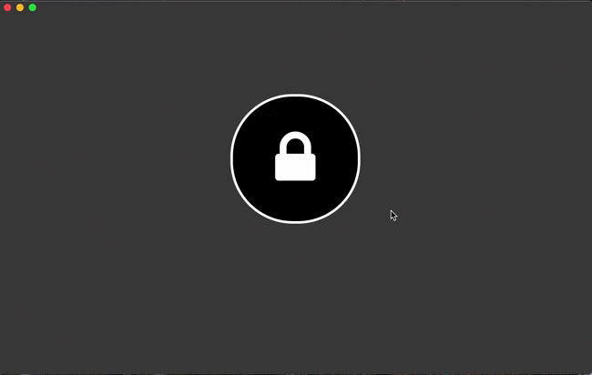
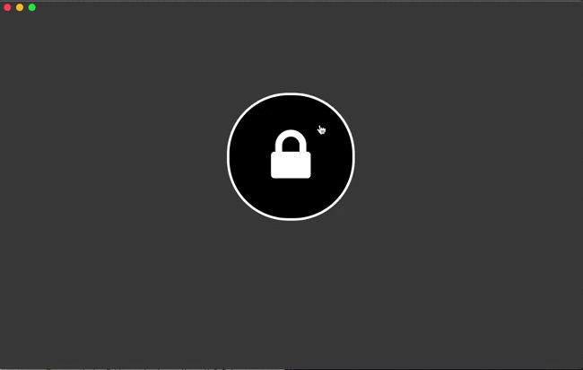

# AES-Electron
File encryption and PDF digital signature software made with Electron.

# Interface (MacOs 10.15.6)
#### File encryption :


#### PDF digital signature :


# Dependencies
- [CryptoJS](https://cryptojs.gitbook.io/docs/)
- [Crypto](https://nodejs.org/api/crypto.html)
- [secure-remove](https://www.npmjs.com/package/secure-remove)
- [node-signpdf](https://www.npmjs.com/package/node-signpdf)

# Algorithms used
- [AES-256 CBC Mode](https://en.wikipedia.org/wiki/Advanced_Encryption_Standard)
- [SHA3-512](https://en.wikipedia.org/wiki/SHA-3)
- [Scrypt](https://en.wikipedia.org/wiki/Scrypt)

# Installation
Take the installer you need (Window | MacOS | Linux) in the ```binaries/``` folder.

# Source Code
You can see the source code in the ```app/``` folder.